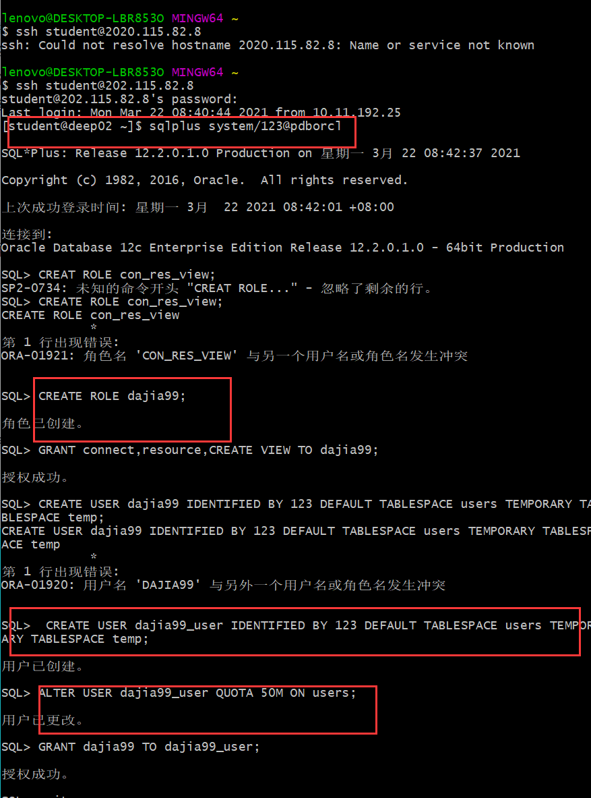
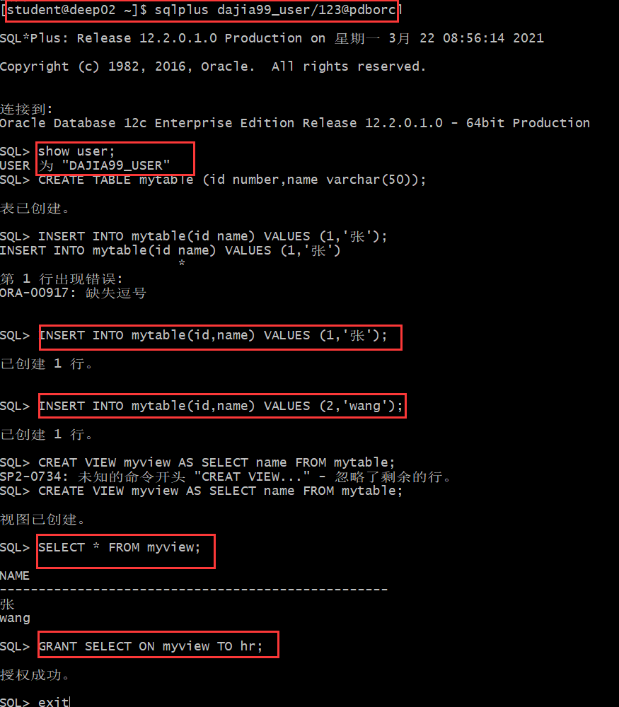
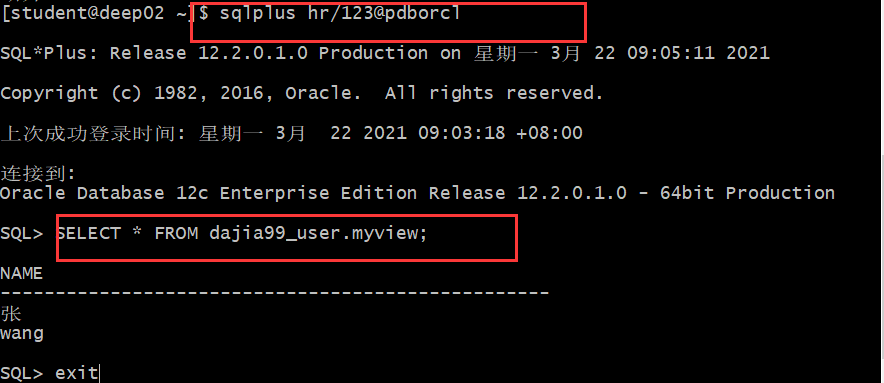
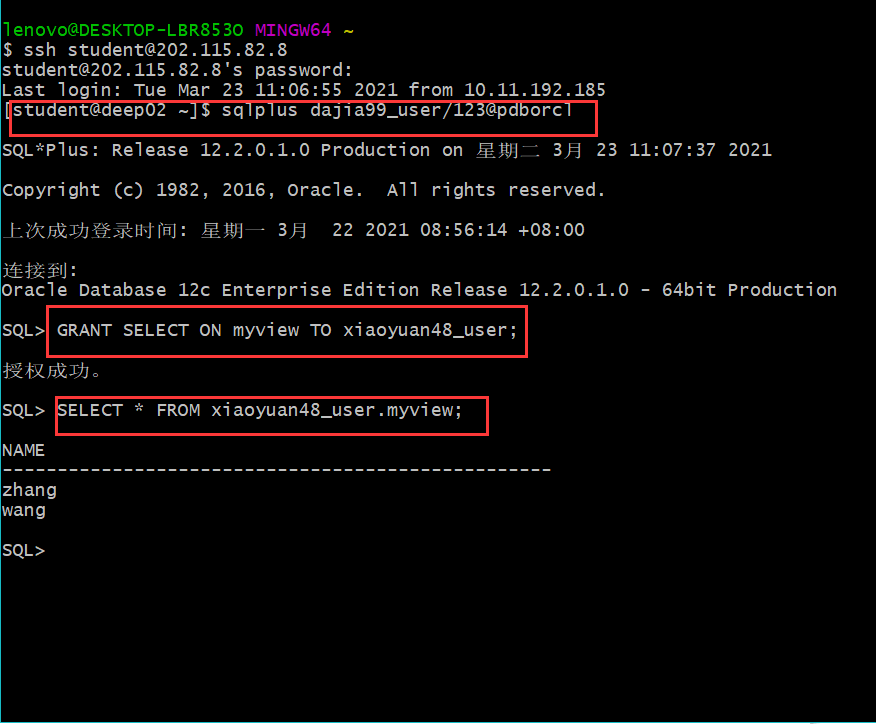
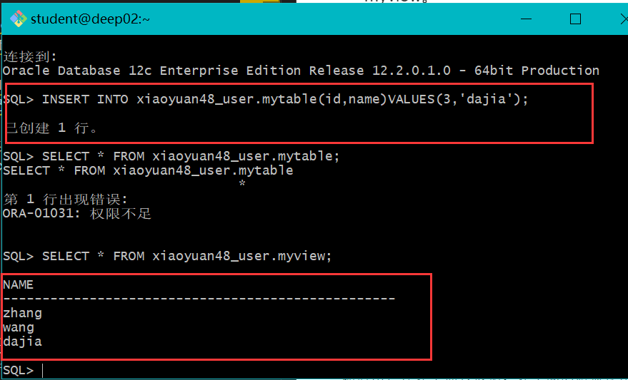
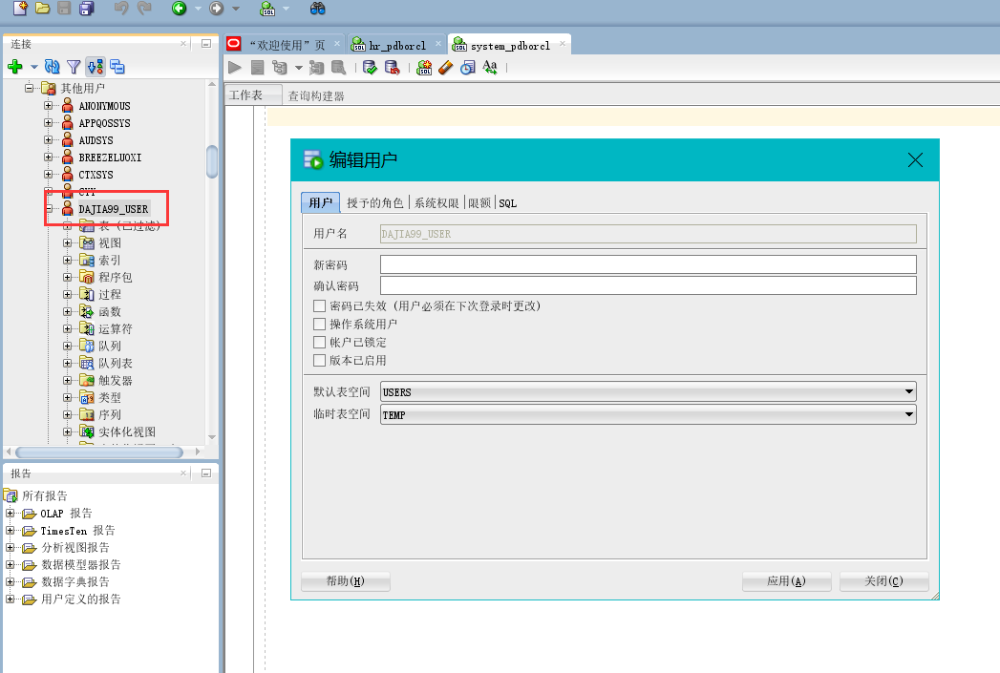
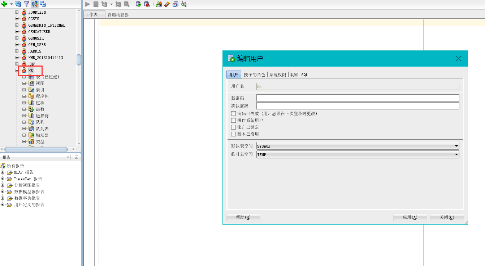

# 实验2：用户及权限管理
### 实验目的：
掌握用户管理、角色管理、权根维护与分配的能力，掌握用户之间共享对象的操作技能
### 实验内容：
Oracle有一个开发者角色resource，可以创建表、过程、触发器等对象，但是不能创建视图。本训练要求：

- 在pdborcl插接式数据中创建一个新的本地角色con_res_view，该角色包含connect和resource角色，同时也包含CREATE VIEW权限，这样任何拥有con_res_view的用户就同时拥有这三种权限。

- 创建角色之后，再创建用户new_user，给用户分配表空间，设置限额为50M，授予con_res_view角色。

- 最后测试：用新用户new_user连接数据库、创建表，插入数据，创建视图，查询表和视图的数据。
### 实验步骤
- 第一步：以system登录到pdborcl，创建角色dajia99和用户dajia99_user，并授权和分配空间。
    
- 第二步：新用户new_user连接到pdborcl，创建表mytable和视图myview，插入数据，最后将myview的SELECT对象权限授予hr用户。
    
- 第三步：用户hr连接到pdborcl，查询new_user授予它的视图myview。
    
### 共享测试：将我的与xiaoyuan48_user进行只读共享和读写共享授权
   

   

   
### 数据库和表空间占用分析
    当全班同学的实验都做完之后，数据库pdborcl中包含了每个同学的角色和用户。 所有同学的用户都使用表空间users存储表的数据。
    表空间中存储了很多相同名称的表mytable和视图myview，但分别属性于不同的用户，不会引起混淆。 
    随着用户往表中插入数据，表空间的磁盘使用量会增加。
### 查看数据库使用情况

- autoextensible是显示表空间中的数据文件是否自动增加。
- MAX_MB是指数据文件的最大容量.

### SQL-DEVELOPER修改用户的操作界面

