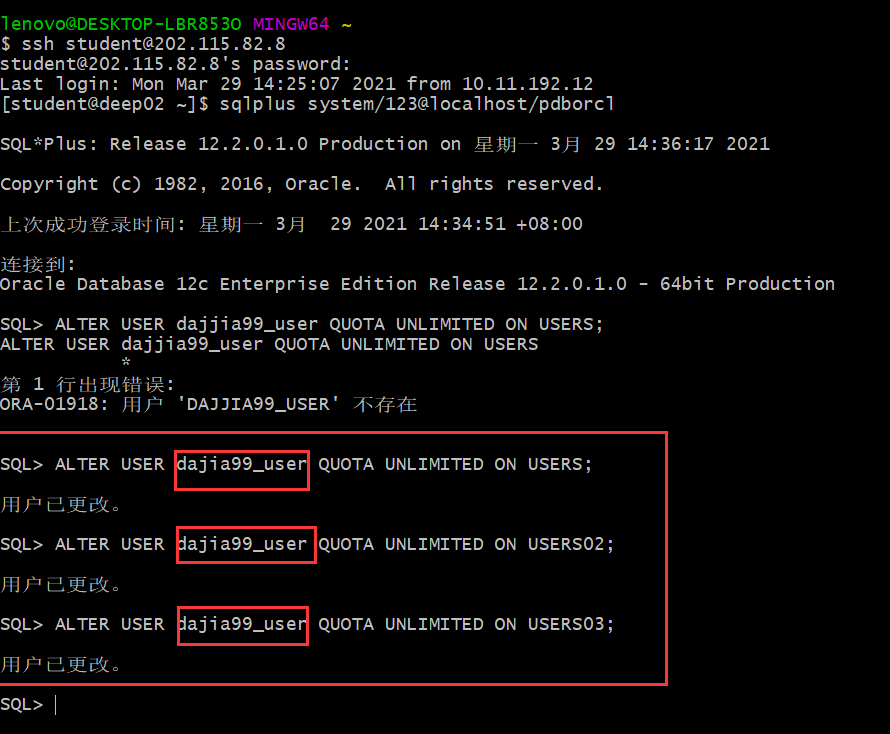
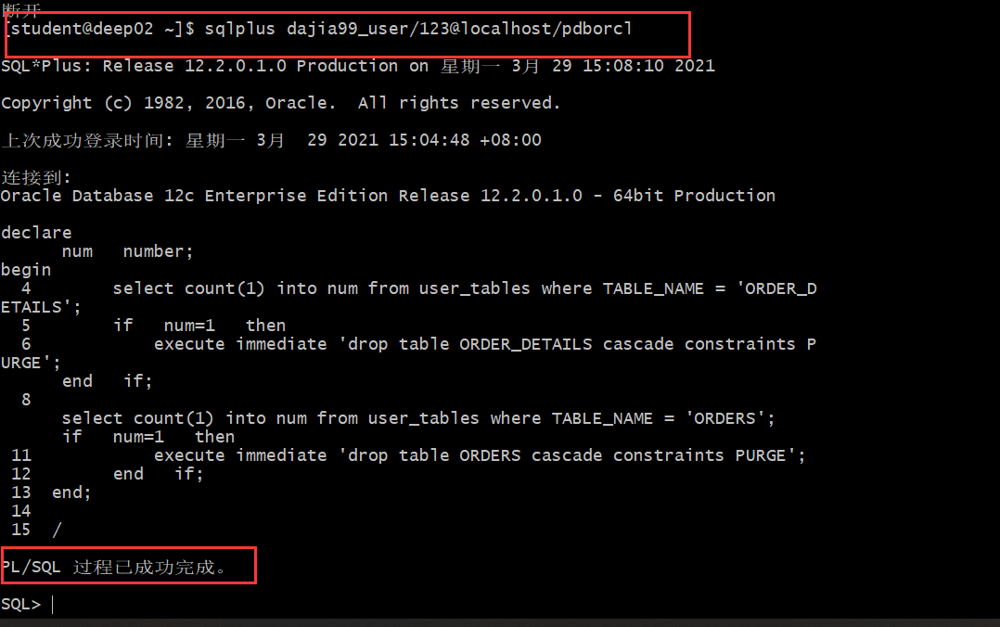
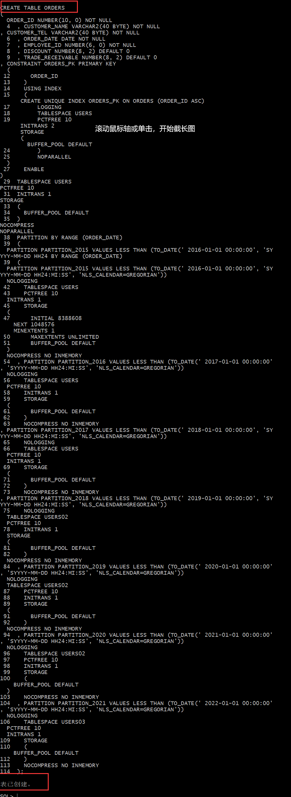
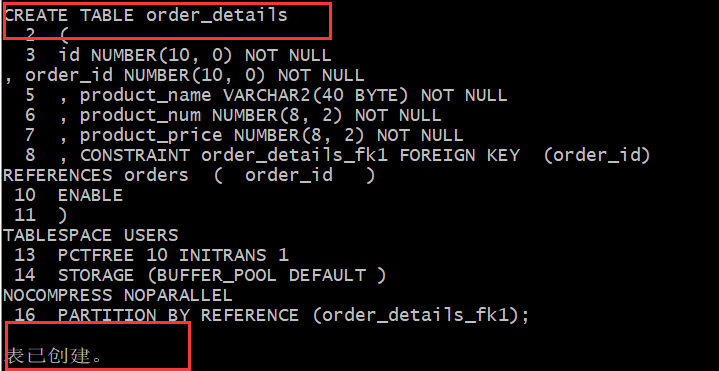
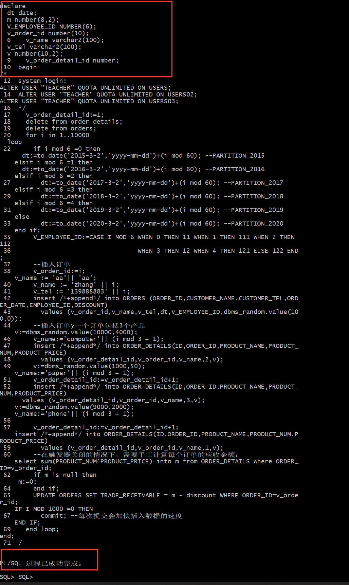
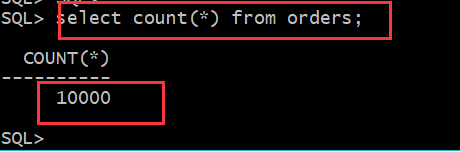
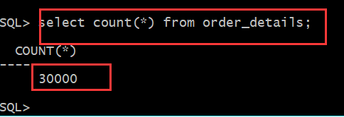
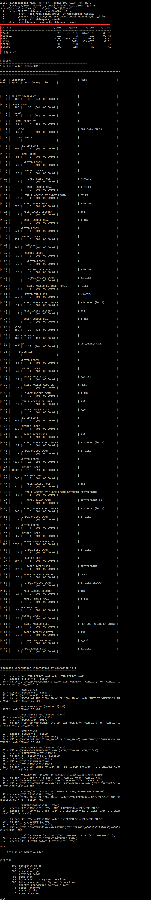
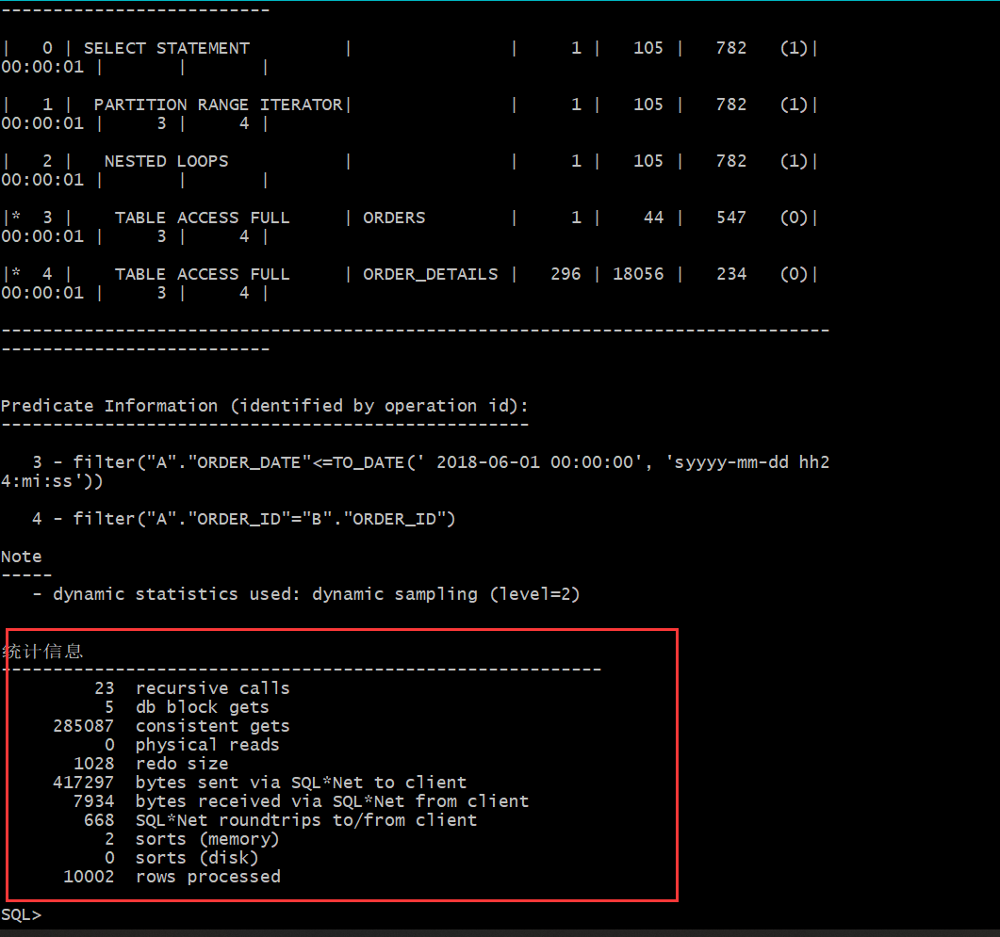

# 实验三 创建分区表
___
### 实验目的：
掌握分区表的创建方法，掌握各种分区方式的使用场景。
___
### 实验内容：
- 本实验使用3个表空间：USERS,USERS02,USERS03。在表空间中创建两张表：订单表(orders)与订单详表(order_details)。
- 使用你自己的账号创建本实验的表，表创建在上述3个分区，自定义分区策略。
- 你需要使用system用户给你自己的账号分配上述分区的使用权限。你需要使用system用户给你的用户分配可以查询执行计划的权限。
- 表创建成功后，插入数据，数据能并平均分布到各个分区。每个表的数据都应该大于1万行，对表进行联合查询。
- 写出插入数据的语句和查询数据的语句，并分析语句的执行计划。
进行分区与不分区的对比实验。
___
### 实验步骤

- 用户名为：dajia99_user
- 更改用户

- 登录dajia99_user进行操作

- 创建table ORDERS

- 创建order_details

- 查询orders

- 查询orders_details

- 查看表空间

- 在system用户下运行(图太长只截取了部分)

